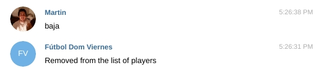

# Futbol List Bot

The idea of this projest is generate a Bot in Telegram to generate a List of players to orgenice a futbol match.

To Run this Bot in telegram, you have to add this boot as an Admin and it search in the incoming messages the word
'juego' or 'Juego' and add your user in the list. When in the list are 10 players, the list is not possible to fill
it more.


To remove you from the list, you have to send the word 'baja' or 'Baja', and you'll automaticly removed from the players list.



To get the list of the playes, you have to send the command 'Lista' or 'lista' to obtain the list.


### How to run this bot?

To run this bot, you have to generate a token in Telegram and add this token to this line:

```bash
updater = Updater("ADD YOUR TOKEN HERE")
```

And the run with the command:

```bash
python3 TelgramFutbolBot.py
```

##### Made with :heart: from :argentina: and :pizza: on :earth_americas: .
